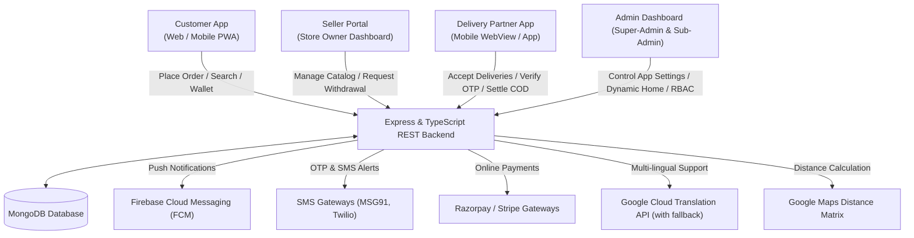

# Village Basket - Complete Project Features Documentation
**सारे फीचर्स की विस्तृत जानकारी (Complete System Features Breakdown)**

This document provides a deep, comprehensive analysis of the **Village Basket** codebase. It maps out all modules, pages, functionalities, and underlying technical integrations for all four roles (Customers, Sellers, Delivery Partners, and Administrators).

---

## 📌 Architectural Overview (सिस्टम आर्किटेक्चर)

Village Basket is a multi-tenant hyper-local marketplace platform designed for retail and wholesale grocery/e-commerce. It connects:
1. **Customers (Users)**: Browse, purchase, track, and earn loyalty points.
2. **Sellers (Merchants)**: Manage inventory, receive orders, and track payouts.
3. **Delivery Partners**: Accept orders, verify delivery via OTP, collect Cash on Delivery (COD), and manage wallets.
4. **Administrators (Super & Sub-Admins)**: Manage configurations, verify payouts, assign roles, monitor systems, and build dynamic homepage grids.

### System Architecture Flow:

---

## 1. 👤 Customer Sub-App Features (कस्टमर ऐप के फीचर्स)
*The front-facing client app where consumers search products, check out, and manage accounts.*

### 🏠 Homepage & Browsing Experience
- **Dynamic Modular Layouts**: The admin dynamically controls homepage sections including Bestseller Cards, Promo Strips, Festival Banners, and "Lowest Prices" products.
- **Shop By Store / Brand**: Customers can shop directly from specific registered nearby merchants/shops.
- **Search Engine**: Fuzzy-matching product search allowing quick filtering by sub-categories, price ranges, and brands.
- **Wishlist Syncing**: Live product wishlist allowing items to be saved for later and synced directly to the database.
- **Store-Specific Sub-Directories**: Specialized storefronts for different product types:
  - Spiritual Store
  - Pharmacy Store
  - E-Gift Cards Store
  - Pet Care Store
  - Sports Equipment Store
  - Fashion & Basics Store
  - Toy & Hobby Stores
- **Multi-lingual Toggle**: On-the-fly interface translation (e.g., English, Hindi, regional languages) utilizing cached translations.

### 🛒 Cart & Checkout System
- **Context-Preserving Cart**: Add/remove products, adjust quantities, and calculate real-time savings.
- **Flexible Checkout Flow**:
  - **Shipping Address Book**: Save multiple addresses with geolocated map pins (latitude/longitude coords).
  - **Delivery Slots System**: Book specific delivery time ranges (Instant vs. Scheduled Delivery Slots).
  - **Coupon Verification**: Real-time coupon application to deduct discounts directly from the subtotal.
  - **Donations Integration**: Optional support to append a custom donation amount during checkout to support local social causes.
  - **Multi-Channel Payments**: Choose between Cash on Delivery (COD), Wallet Balance, UPI, or Online Card payments.

### 💼 User Account Dashboard (`/user/account`)
- **Profile Customization**: Edit personal details, date of birth, and app notifications/privacy configurations.
- **Order History & Quick Re-order**: Complete list of past orders with invoice generation and an "Order Again" button to prefill the cart with identical items.
- **Loyalty Reward Coins Program**:
  - Earn reward coins on purchases.
  - Explore the Reward Store to redeem coins for special products.
  - Track redemption orders from the past.
- **Customer Digital Wallet**: View transactions history, credit balance, and refunds automatically added to the wallet.
- **Self-Account Deletion**: Safe, soft-delete option to deactivate the profile and wipe sessions.

---

## 2. 🏪 Seller Portal Features (विक्रेता / मर्चेंट फीचर्स)
*A dedicated dashboard interface for merchant partners to run their operations.*

- **Seller Onboarding / Sign-Up**: Multi-stage registration capturing store name, address, business categories, pan card details, FSSAI licensing, bank accounts for payouts, and coordinates.
- **Storefront Control**: Toggle status (Open vs. Closed), update store banners, upload logos, and set operating hours.
- **Catalog Management**:
  - Create and edit product listings (prices, descriptions, media, variants).
  - Categorize products into pre-approved categories and subcategories.
  - Set specific tax (GST) rates per product.
- **Inventory & Stock management**: Real-time stock counts updating dynamically on orders.
- **Order Pipeline Execution**:
  - Receive notifications of new orders.
  - Accept, package, and mark orders as "Processed" or "Ready for pickup".
  - Handle multi-seller pickup configurations.
- **Return Request Management**: View customer return complaints, review details, and approve/reject refund requests.
- **Wallet & Payouts**:
  - View total earned balance.
  - Submit bank payout withdrawal requests subject to minimum validation limits.
  - Access CSV exportable sales reports.

---

## 3. 🛵 Delivery Partner Sub-App Features (डिलीवरी बॉय फीचर्स)
*An interface optimized for delivery personnel to fulfill logistics.*

- **Availability Management**: Toggle "Online/Offline" availability state.
- **Order Fulfillment Pipeline**:
  - **Assigned Orders**: View pending pickups from merchants and destinations for customers.
  - **Logistics Helper**: View sellers within serviceable range on maps.
  - **Verification OTP**: Verify final hand-overs using the customer's permanent 4-digit security code.
- **Interactive Earnings & Wallet Tracker**:
  - View commission per delivery.
  - Track total cash collected (COD orders) pending settlement with admin.
  - Request payout transfers directly into their bank accounts.
- **Mobile PDF/CSV Report Exports**: Direct mobile-optimized links to export history logs without issues inside mobile web views.

---

## 4. 👑 Administrative Control Panel Features (एडमिन पैनल फीचर्स)
*The central command dashboard containing full control over platform operations.*

### 📊 Business Dashboard & Analytics
- **Summary Metrics**: Real-time sales volume, active user counts, pending orders, and payout request counts.
- **Graphical Analytics**: Order charts, sales timeline analytics (Line/Bar charts), and geographical sales distributions.

### 🛠️ Configuration & Catalog Engine
- **Hierarchical Catalog Management**: Add, update, delete categories, subcategories, brands, and taxes.
- **Dynamic Page Builder (Layout CMS)**:
  - Add/re-order homepage banners and sections.
  - Set up Bestseller Cards, festival campaigns, lowest price blocks, and promotional strips.
  - Define custom Header Categories for navigation.
- **System Settings**: Configures support hotlines, global GST switches, global commission default percentages, and app branding assets.

### 💸 Financial Control Panel
- **Commission Settlement**: Process automated commissions split between platform and sellers.
- **Cash Collection Verification**: Audit and approve cash collected by delivery boys (managing safe cash hold limits).
- **Withdrawals Audit**: Process, execute, or reject bank transfer requests from Sellers and Delivery Partners.
- **Sms & Notification Campaigner**: Edit SMS Gateway API keys (Twilio, MSG91) and dispatch bulk push notification campaigns.

### 🛡️ Access Control & System Management
- **Sub-Admin Permission Matrix (RBAC)**: Create sub-admin users and restrict their sidebar page access to specific routes (e.g., only orders, only catalog).
- **Geographical Zone Controls**: Create and assign serviceable zone boundaries.
- **System Maintenance Mode**: Toggle maintenance mode displaying a custom downtime screen to customers.
- **FAQ & App Policy Manager**: Update legal clauses, refund policies, FAQs, and delivery partner agreements dynamically.

---

## 🗄️ Database Schemas & Data Model Matrix (डाटाबेस स्कीमा)

The project leverages a robust MongoDB schema architecture. The key models are:

| Model Name | Primary Responsibility | Key Fields |
| :--- | :--- | :--- |
| **`Customer`** | Customer accounts & preferences | `phone`, `refCode`, `deliveryOtp`, `rewardCoins`, `walletAmount`, `donationStats` |
| **`Seller`** | Merchant store data & finances | `storeName`, `location (GeoJSON)`, `serviceRadiusKm`, `balance`, `requireProductApproval`, `status` |
| **`Delivery`** | Delivery agent profiles | `vehicleNumber`, `bonusType`, `isOnline`, `balance`, `cashCollected`, `approvalStatus` |
| **`Order`** | Checkout transactions & status | `orderNumber`, `orderType (Instant/Scheduled)`, `deliverySlot`, `paymentStatus`, `status`, `deliveryBoy`, `donationAmount` |
| **`AppSettings`** | Global parameters | `paymentMethods`, `deliveryConfig (isDistanceBased)`, `globalCommissionRate`, `maintenanceMode` |
| **`RewardItem`** | Loyalty reward items | `name`, `coinsRequired`, `stock`, `isActive` |
| **`WalletTransaction`**| Financial audit trail | `userId`, `amount`, `type (CREDIT/DEBIT)`, `description` |
| **`Category`** | Product departments | `name`, `slug`, `order`, `isActive` |

---

## 💡 Key Technical Implementations (तकनीकी विशेषताएं)

1. **Auto-Translation Engine**: The platform implements an automated translation system. If Google Cloud Translate credentials are not found, it falls back to a free API alternative. High performance is maintained using client-side (IndexedDB/localStorage) and server-side in-memory caching.
2. **Delivery OTP Verification**: Delivery verification uses a permanent, highly secure 4-digit code generated for each customer, eliminating SMS network failure delays during deliveries.
3. **Distance-Based Delivery Charge Engine**: Configurable base distance rates combined with per-kilometer rates calculated via maps integration, giving admins granular shipping cost control.
4. **FCM Device Registry**: Handles push notifications across web browsers and mobile browsers simultaneously.

---

*This guide serves as a single source of truth for the functionalities built into the Village Basket codebase.*
